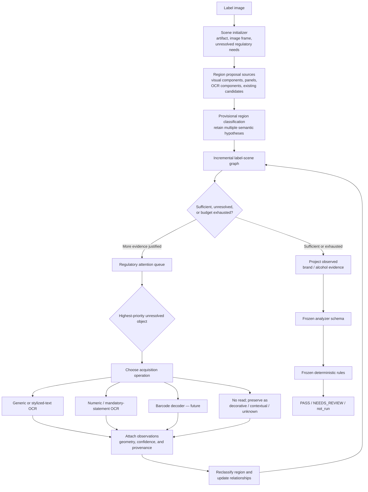

# Semantic Label-Scene Acquisition and Regulatory Decision Flow

This diagram captures the intended image-first, semantic-region workflow while preserving the frozen production boundary. OCR is one acquisition operation attached to a provisional semantic object; it is not the scene model itself.

## Boundary represented by the diagram

The left-hand loop is an incremental, evaluation-first scene-understanding model:

`observe → segment → provisionally classify → choose operation → acquire content → update scene → redirect attention`

The right-hand path remains frozen:

`project observed evidence → analyzer schema → deterministic rules → PASS / NEEDS_REVIEW / not_run`

The diagram does **not** authorize production semantic routing, new production fields, specialized OCR execution, barcode decoding, or changes to reviewer authority. Those require separately authorized work.
